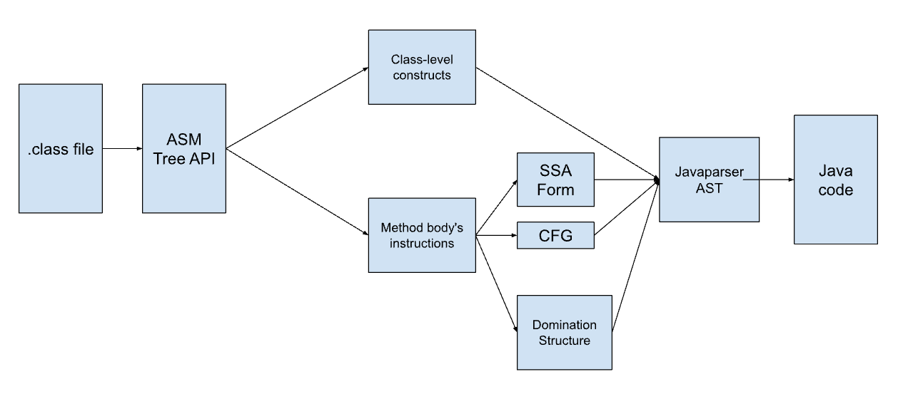

# Developer Guide

This document details the design and implementation of Jade. For documentation of each component or class with KDoc, refer to {insert link to generated KDoc HTML here}.

## Decompilation

At a high level, Jade works as follows:
- First, Jade takes a path to a Java `.class` file as its input.
- Then, raw Java bytecodes from the `.class` file are read using [ASM](https://asm.ow2.io/), and accessed via the ASM Tree API.
- Subsequently, Jade builds a Java abstract syntax tree using data structures provided by [JavaParser](https://javaparser.org/).
	- Bytecode sections belonging to class-level constructs (fields, method signatures, etc.) are directly translated from bytecode into JavaParser data structures.
	- Bytecode sections belonging to method bodies with instructions are converted into 3 useful intermediate representations: control flow graph (CFG), Static-Single Assignment (SSA) form and CFG Domination Structure form. Jade utilizes these three representations to construct a Java abstract syntax tree.
- Finally, the abstract syntax tree is converted into Java code and written to the output stream.

The following figure illustrates Jade's decompiling workflow:



### Subcomponents
Jade's source consists of the following subcomponents:
- `/analysis`: Algorithms for analyzing code.
- `/asm`: Wrappers around ASM library, a library for manipulating JVM bytecode / `.class` file.
- `/classfile`: Code for parsing data from JVM bytecode / `.class` files.
- `/decompile`: Code for decompiling JVM bytecode.
- `/javaparser`: Wrappers around JavaParser library, a library for representing Java ASTs.
- `/jgrapht`: Wrappers around JGraphT library, a library for vertex-edge graphs.
- `/main`: Main command-line entry point.
- `/maven`: Code for downloading and testing againt Maven repositories.
- `/util`: Utility classes.

### Parsing and Decompiling Class-level Constructs
(TODO: High-level implementation strategy & key design decisions)

### Parsing and Decompiling Method Bodies
(TODO: High-level implementation strategy & key design decisions)

### Computation of Control Flow Graph
(TODO: High-level implementation strategy & key design decisions)

### Computation of Domination Structure
(TODO: High-level implementation strategy & key design decisions)

### Computation of Static Single Assignment (SSA) Form
(TODO: High-level implementation strategy & key design decisions)

### Decompilation Flow
(TODO: High-level implementation strategy & key design decisions)

## Testing against bytecodes

### Obtaining test data
- To download a repository from Maven for testing and development
	- Look for the desired MVN repository from [MVN Repository](https://mvnrepository.com/) and go to the desired version's page.
	-  To download `.class` bytecodes of a repository, click on "jar (XXX KB)".
	 
	- Unzip the jar file. It might be useful to filter out `.class` files recursively using the following bash script:
	```bash
	for i in $( find repo_extracted -name "*.class" -type f ); do
		echo $i
		cp $i repo_class_files
	done
	```


	- To download the original source code (in `.java`), click on "View All", then look for the jar file with the suffix `-sources.jar`. You may unzip such jar file and filter out `.java` files and copy them into a separately folder as above.

	 

	 

Useful medium-sized repository:
- [https://mvnrepository.com/artifact/junit/junit/4.13.2](https://mvnrepository.com/artifact/junit/junit/4.13.2)
### Class-level constructs
The correctness of decompiling class-level constructs can be ascertained by the following process:

1) Decompile Java file with Jade using the `decompile` command
```
./gradlew run --args="decompile '<path to file>/SampleInterface.class' tmp"
```
2) Recompile the decompiled code with `javac tmp/SampleInterface.java` or `javac tmp/SampleAbstractClass.java`

3) Decompile given test files 
    ```
    ./gradlew run --args="decompile '<path to file>/SampleInterface.class' tmp"
    ```
This places the decompiled files in a folder called `tmp`.


4) Compare the class skeletons of old and new bytecodes. This can be done using displayed results of `javap -p -s` command.
First run
```
javap -p -s <path to original class files> > 1.txt
```

Then run
```
javap -p -s <path to newly generated class file in /tmp> > 2.txt
```

Then you can do `diff 1.txt 2.txt`. If the class skeletons of old and new bytecodes match exactly, the decompiling can be considered correct. If the two do not match exactly, further investigation and judgment are needed.

### Method body
(TODO)